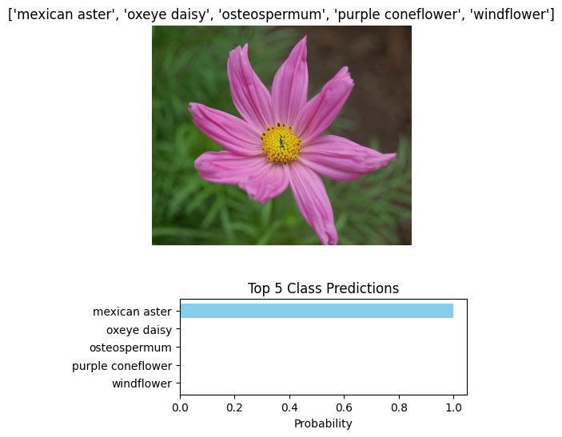

# AI Programming with Python Project

Project code for Udacity's AI Programming with Python Nanodegree program. In this project, students first develop code for an image classifier built with PyTorch, then convert it into a command line application.

## Overview

The goal of this project is to build and evaluate an image classifier using PyTorch. The project involves:

- Developing an Image Classifier: Implementing a deep learning model to classify images into categories. The first part of this project can be found in the notebook `Image Classifier Project.ipynb`. Here is where we work through defining the neural network architecture, process our images and train/validate and test our network's accuracy.

- Command Line Interface (CLI): Converting the image classifier into a command-line tool that allows users to train the model and make predictions.
----------------
### Jupyter Notebook
To run the notebook file `Image Classifier Project.ipynb`, ensure you have Jupyter installed:
```bash
pip install notebook
jupyter notebook
```
#### The notebook contains the full process: 
1. Loading and preprocessing the data.
2. Training a neural network model using transfer learning (with architectures like VGG16 and DenseNet).
3. Saving and loading the trained model.
4. Making predictions on new images and displaying the top K probable classes.
5. Using a Jupyter Notebook (`Image Classifier Project.ipynb`) to guide through the complete workflow, including visualizations and explanations.



-------------
## run the project on the command line
### Dataset
For the dataset you can [download it here](https://s3.amazonaws.com/content.udacity-data.com/nd089/flower_data.tar.gz). The dataset is split into three parts, training, validation, and testing.

### 1. Training the Model
Train a new network on a data set with `train.py`
 - Basic usage: python train.py data_dir
 - Prints out training loss, validation loss, and validation accuracy as the network trains

Arguments for `train.py`:
```bash
positional arguments:
  data_dir              Directory of the training images

optional arguments:
  -h, --help            show this help message and exit
  --gpu                 Use GPU for training, defaults to False
  --arch ARCH           Choose an architecture for the network {'vgg16', 'vgg19', 'densenet121', 'densenet161'}, defaults to VGG16
  --save_dir SAVE_DIR   Set directory to save checkpoints
  --learning_rate LEARNING_RATE
                        Set the learning rate hyperparameter, defaults to 0.001
  --hidden_units HIDDEN_UNITS
                        Set the hidden unit amount, defaults to 512
  --epochs EPOCHS       Set the total amount of epochs this network should train for, defaults to 20
```
#### Command Example
```bash 
> python train.py flowers --arch densenet161 --epochs 1 --learning_rate 0.001 --hidden_units 512 --gpu
--------------Result-----------------
Running on device: cuda
Info -- (1) Epochs.    Learning Rate: 0.001.    Hidden Units: 512.    NN Arch: densenet161.
Loading data...
Data loaded successfully.
The model prepared successfully.
Starting training with 1 epochs...
Epoch 1/1
Epoch 1/1.. Train loss: 3.551.. Validation loss: 2.104.. Validation accuracy: 51.18%
Epoch 1/1.. Train loss: 1.668.. Validation loss: 1.307.. Validation accuracy: 68.88%
Epoch 1/1.. Train loss: 1.093.. Validation loss: 1.043.. Validation accuracy: 72.13%
Epoch 1/1.. Train loss: 0.976.. Validation loss: 0.818.. Validation accuracy: 76.45%
Epoch 1/1.. Train loss: 0.790.. Validation loss: 0.656.. Validation accuracy: 82.17%
Training completed.
Test Accuracy: 77.97%
Model saved successfully.
```
--------

### 2. Making Predictions
Predict flower name from an image with `predict.py` along with the probability of that name. That is, you'll pass in a single image `/path/to/image` and return the flower name and class probability.
 - Basic usage: python predict.py --image_path path/to/image.jpg --checkpoint path/to/checkpoint.pth

Arguments for `predict.py`:
```bash
positional arguments:
  image_path            Path to image to predict
  checkpoint            Checkpoint file location

optional arguments:
  -h, --help            show this help message and exit
  --gpu                 Use GPU for training, defaults to False
  --top_k TOP_K         Return top K most likely classes
  --category_names CATEGORY_NAMES
                        Mapping file of class id to real names, defaults to cat_to_name.json
```
#### Command Example
```bash 
> python predict.py D:\Fatma\projects\aipnd-project\flowers\test\34\image_06961.jpg D:\Fatma\projects\aipnd-project\checkpoints\checkpoint.pth --top_k 5 --gpu 
-------------Result-----------------
Loading checkpoint...
Checkpoint is loaded successfully!!
Start prediction...
Start processing image....
processing image is completed!!!
prediction is completed!!!
Top K Classes and Probabilities:
Class: 34       , Probability: 54.955%  , Name: mexican aster    
Class: 5        , Probability: 30.610%  , Name: english marigold 
Class: 63       , Probability: 6.486%   , Name: black-eyed susan 
Class: 100      , Probability: 1.957%   , Name: blanket flower   
Class: 49       , Probability: 1.484%   , Name: oxeye daisy      
finished!!!
```

